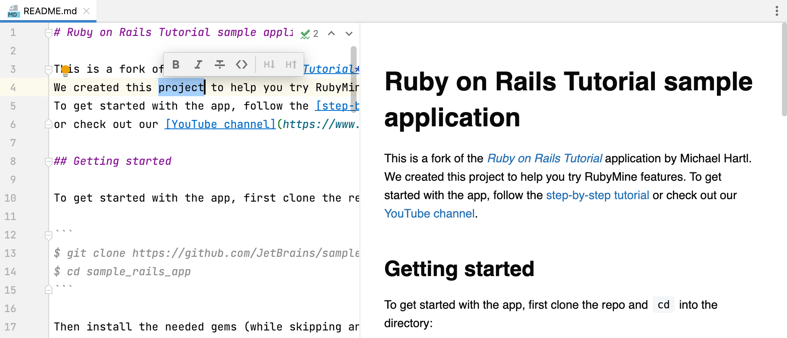

# Markdown Assignment

**Name**: _Jeevan prasath G_

**class**: _1 MCA C_

**topic**: _Markdown Tutorial_

**Date**: _17/02/2023_

# contents

1. [What is MarkDown?](#what-is-markdown)
2. [What is markdown File Extension?](#markdown-file-extension)
3. [Advantages]()
4. [How do we open MarkDown file](#how-do-we-open-markdown-file)
5. [Why we use MarkDown ?]()
6. [HTML Elements]()
7. [Headings]()
8. [Paragraph]()
9. [Formatting  Elements]()
10. [Block Quotes]()
11. [Quoting Code]()
    - Multiple Paragraph
    - Nested Block Quotes
    - Quotes
12. List
    - Nested List
    - Task List
13. Horizontal Rule
14. Links
    - referral Links
15. Images
    - Referral Image
16. Tables
    - Tables alignment
17. Emoji


## What is MarkDown
***

* MarkDown open source 
* MarkDown is created by john gruber
* MarkDown contains plain text that is formatted in plain text.,and is readable using specific syntax beforeconverted to HTML
* MarkDown is simple and east to learn
* helps users.

## markdown File Extension
***
```
.md
.mdarkdown
.mdown

```


no office extension
create plain text and save as .md

some of them popular vendors  uses html 
github uses .md or .mdown


## How do we open MarkDown file
***





